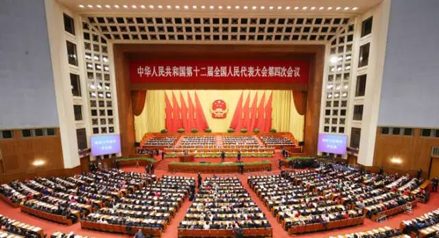

# 定了！5月1日起全面实施“营改增” 

2016-03-05 中国政府网 国家税务总局

新华社记者 姚大伟 摄

　　3月5日，第十二届全国人民代表大会第四次会议开幕，听取国务院总理李克强作政府工作报告，审查计划报告和预算报告。

　　李克强指出，适度扩大财政赤字，主要用于减税降费，进一步减轻企业负担。今年将采取三项举措。**一是全面实施营改增，从5月1日起，将试点范围扩大到建筑业、房地产业、金融业、生活服务业，并将所有企业新增不动产所含增值税纳入抵扣范围，确保所有行业税负只减不增。**二是取消违规设立的政府性基金，停征和归并一批政府性基金，扩大水利建设基金等免征范围。三是将18项行政事业性收费的免征范围，从小微企业扩大到所有企业和个人。实施上述政策，今年将比改革前减轻企业和个人负担5000多亿元。同时，适当增加必要的财政支出和政府投资，加大对民生等薄弱环节的支持。创新财政支出方式，优化财政支出结构，该保的一定要保住，该减的一定要减下来。

　　加快财税体制改革。合理确定增值税中央和地方分享比例。把适合作为地方收入的税种下划给地方，在税政管理权限方面给地方适当放权。进一步压缩中央专项转移支付规模，今年一般性转移支付规模增长12.2%。全面推开资源税从价计征改革。依法实施税收征管。建立规范的地方政府举债融资机制，对财政实力强、债务风险较低的，按法定程序适当增加债务限额。各级政府要坚持过紧日子，把每一笔钱都花在明处、用在实处。